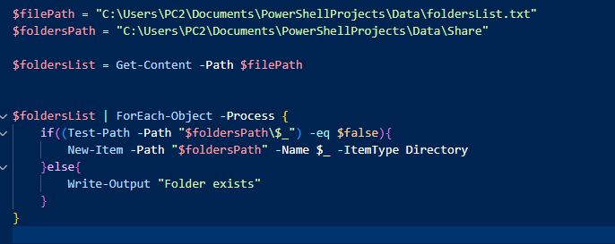
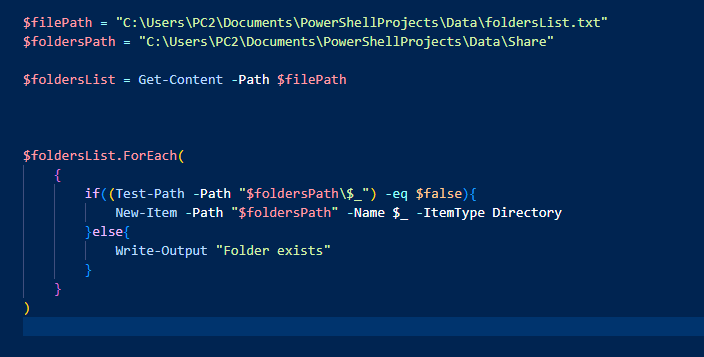

# It's a PowrShell code to create folders.
# It's possible to create folders manually but imagine you create tens of folders
# Then it's much easier to put your folder names in a text file and automate creating files process.
# And whenever you append new folder names, those which already exist will be ignored and
# new ones will be created.
# This can be done in different ways in PowerShell

# First way with 'foreach' method!

[alt text](Data/images/01.PNG)

# The second with 'Foreach-Object" cmdlet

# PowerShell is really a powerfull tool. 
# There's also another way for the same automation.
# just like in the previous file. We can use .ForEach without pipe.
# the code inside Curly brackets won't change

